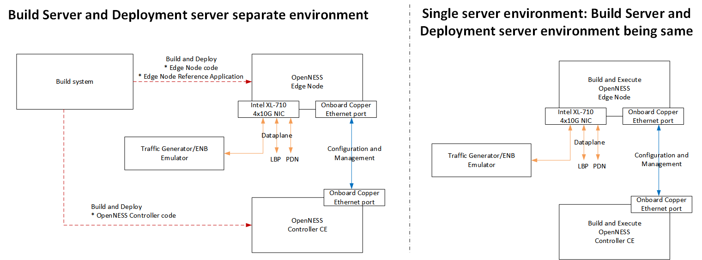

```text
SPDX-License-Identifier: Apache-2.0
Copyright © 2019 Intel Corporation and Smart-Edge.com, Inc.
```

# 1. Introduction
## Purpose
This document is intended for OpenNESS Edge Node setup and serves as a guide on setting up OpenNESS Edge Node product on required hardware test platform using delivered automation scripts. 

## 1.1. Scope
Section 2 – describes software components being used by OpenNESS Edge Node

Section 3 – shows available environment setup variants

Section 4 – details on hardware requirements

Section 5 – hardware setup instructions

Section 6 – operating system set up

Section 7 – running automation scripts

Section 8 – troubleshooting

Section 9 - changelog

## 1.2. Terminology
|                    |                                                                                   |
|--------------------|-----------------------------------------------------------------------------------|
| OpenNESS Edge Node | This product name                                                                 |
| DPDK               | Data Plane Development Kit                                                        |
| QEMU               |Quick Emulator; open source emulator for hardware virtualization                   |
| VM                 | Virtual Machine                                                                   |
| Docker             | Platform for creating and running applications inside containers                  |
| Container          | Executable package containing application code, runtime, libraries and settings.  |
| Ansible            | Open source automation platform                                                   |
| OpenNESS           | Controller Community edition                                                      |

# 2. Software overview

OpenNESS Edge Node uses a set of open source applications and framework, both inside the product and during installation/deployment process.

OpenNESS User and developer Prerequisites: 
- Understanding and usage of virtualization environment based on Libvirt 
- Understanding and usage of Container environment based on Dockers 
- Understanding and usage of Cloud Native environment based on Kubernetes
- Basic understanding of Networking 
- Go lang for OpenNESS microservices 
- C lang and DPDK for dataplane 
- HTTP REST, json, gRPC, Protobuf for API 
- Amazon AWS IoT Greengrass Core for Cloud adapters 
- Baidu Cloud for Cloud adapters 
- TLS for authentication  

## 2.1. CentOS Linux 
Product is running on CentOS 7.6 x86_64 operating system. The same one is used for building product components and deploying/running them in dedicated hardware platform.
It's suggested to install a minimal amount of rpm packages inside operating system, so the "Minimal" ISO of CentOS is recommended for use when preparing any of the test machine.

## 2.2. Additional software
OpenNESS Edge Node uses open source software for building, deployment and running applications, among which are the most important ones: QEMU, Docker, DPDK, Ansible.
There is no need to install them manually, as all dependencies, downloading them from the internet will be handled by automation scripts.

### 2.2.1. QEMU
On CentOS Linux the latest tested version of Quick Emulator (QEMU) is v3.0.1. It will be installed automatically by automation scripts

### 2.2.2. Docker
Community Edition of Docker software is used. The latest tested versions is v18.09.6 (will be installed automatically).

### 2.2.3. DPDK
DPDK v18.08 is the version required and installed automatically to compile and run all applications. 

### 2.2.4. GO language
Latest version checked and used is 1.12.4 (installed automatically).

### 2.2.5. Ansible
Ansible is an automation platform used for configuring operating system, installing packages, additional software and resolving all package/software dependencies automatically, without user interaction.
It will be installed automatically by the first automation script being ran on hardware with newly installed CentOS operating system.

# 3. Environment setup variants
OpenNESS Edge Node requires CentOS 7.6 x64 operating system to be installed on hardware.
For building product binaries, images and containers only one server is required. 



In this scenario, all actions will take place on the same machine.
> NOTE: For a dual server setup, where one server is being used for building binaries, product images, and a second server for deplyoing them in a production server, please see README.md documents under the following repository subfolders: `./scripts/ansible/build_server` and `./scripts/ansible/deploy_server` that will guide you throught a different setup on two machines.

OpenNESS supports Network Edge and On-Premise edge deployment. For details of these two deployment model please refer to the OpenNESS architecture specification. 
- Network Edge deployment is based on Kubernetes 
- On-Premise Edge deployment is based on Docker Containers and VMs based on libvirt. 

The OpenNESS Edge Node and OpenNESS controller components build would remain unchanged for both the deployments. For the Network Edge deployment this document assumes that a Kubernetes cluster is setup with Kubernetes master and Node is added to the cluster. The document does not provide the steps for setting up Kubernetes cluster. 

Reference for setting up Kubernetes cluster on CentOS: https://kubernetes.io/docs/setup/production-environment/tools/kubeadm/install-kubeadm/

# 4. Hardware requirements
## 4.1. Supported platform
OpenNESS Edge Node product has been tested using the following hardware specification:

-  Super Micro 3U form factor chasis server, product SKU code: 835TQ-R920B
- Motherboard type: X11SDV-16C-TP8F
  https://www.supermicro.com/products/motherboard/Xeon/D/X11SDV-16C-TP8F.cfm
- Intel® Xeon® Processor D-2183IT

|                  |                                                               |
|------------------|---------------------------------------------------------------|
| SKX-SP           | Compute Node based on SKX-SP                                  |
| Board            | WolfPass S2600WFQ server board(symmetrical QAT)CPU            |
|                  | 2 x Intel(R) Xeon(R) Gold 6148 CPU @ 2.40GHz                  |
|                  | 2 x associated Heatsink                                       |
| Memory           | 12x Micron 16GB DDR4 2400MHz DIMMS * [2666 for PnP]           |
| Chassis          | 2U Rackmount Server Enclosure                                 |
| Storage          | Intel M.2 SSDSCKJW360H6 360G                                  |
| NIC              | 1x Intel Fortville NIC  X710DA4  SFP+ ( PCIe card to CPU-0)   |
| QAT              | Intel  Quick Assist Adapter Device 37c8                       |
|                  | (Symmetrical design) LBG integrated                           |
| NIC on board     | Intel-Ethernet-Controller-I210 (for management)               |
| Other card       | 2x PCIe Riser cards                                           |

# 5. Hardware setup
There are no special requirements for setting up hardware compared to a typical network server setup, except BIOS settings and making sure the server is able to reach the internet (required to download other packages).

## 5.1. BIOS revision upgrade
Before proceeding, make sure the BIOS is updated to the latest available stable release.
Please refer to the manufacturer user guide on upgrading BIOS firmware.

## 5.2. BIOS setting
There are few required BIOS settings for OpenNESS Edge Node server that operator needs to set. They are CPU and power management related.
It's recommended to first reset BIOS to factory defaults, and then set the following options as shown below:
- BIOS - Advanced - Processor Configuration:
  - Intel(R) Hyper-Threading = DISABLED
  - Intel(R) Virtualization Technology = ENABLED
- BIOS - Advanced - Power & Performance:
  - Workload Configuration = BALANCED
- BIOS - Advanced - Power & Performance - CPU C State Control:
  - Package C-State = C0C1 state
  - C1E = DISABLED
  - PRocessor C6 = DISABLED
- BIOS - Advanced - Power & Performance - Hardware P States:
  - Hardware P-States = DISABLED
- BIOS - Advanced - Power & Performance - CPU P State Control:
  - Enchanced Intel SpeedStep(R) Tech = DISABLED
  - Intel(R) Turbo Boost Technology = DISABLED
  - Energy Efficient Turbo = DISABLED

# 6. CentOS operating system set up
Evaluated version of CentOS Linux is v7.6.1810 (Minimal). The iso file is available from mirror sites listed at the link:
https://wiki.centos.org/Download

> NOTE: It's recommended to use a Minimal CentOS Linux installation media, as only a minimal set of packages will be installed on disk. This brings the benefits of faster installation time, reduced OS complexity and overload (GUI, needless services running in background).

## 6.1. Base OS installation options
Since Minimal installation image does not contain any options for packages to be installed, the only options operator has to set are:
- correct time and timezone
- root user password
- destination media location (disk/partitions)
- network settings (IP addresses on chosen NIC) for accessing the internet

## 6.2. Proxy setup
If the server is not using proxy to to access the internet, please skip this subsection.
If proxy is used, please follow below steps to configure both operating system and services that will be ran later by automation scripts.
Example configurations of proxy for each service or operating system component are available for preview in subfolder ``` ./examples/proxy```.
Their structure reflect the real one in your operating system. 
It is advised to not copy them directly to your operating system but instead, modify your own ones to contain items
available in those example files.

#### OS setup files:
* /etc/environment
   Make sure that your current environment file contains variables for http_proxy and HTTP_PROXY and if https proxy is 
   also used, then also include https_proxy and HTTPS_PROXY in your config file. Additionally, include ftp_proxy and FTP_PROXY variables with correct IP and port addresses.
   See example in provided file in folder: `../examples/proxy/etc/environment`
* /etc/yum.conf
   Add one line for http proxy to your yum.conf file as shown in `../examples/proxy/etc/yum.conf`
   > Tip: Make sure the port is correct and slash sign (/) is present at the end of the line.

#### Docker service
* `/etc/systemd/system/docker.service.d/http-proxy.conf`
   Example configuration for docker service is inside file `../examples/proxy/etc/systemd/system/docker.service.d/http-proxy.conf`
   If you do not have Docker configured and this file is missing in /etc folder, you may copy this example file to given path in
   /etc folder and modify it according to your needs.
* `/root/.docker/config.json`
   Example configuration is inside file `../examples/proxy/root/.docker/config.json`
   
> Tip: Once proxy setup is complete, it is advised to reboot server or at least log out and log in again, so that at least
`/etc/environment` will be read by login service and shell startup scripts.

> NOTE: If you are not sure whether your proxy settings work, you may run a simple `yum update` command to check whether 
the internet is reachable with given proxy settings. 

## 6.3. Packages and OS upgrade
Once installation Of CentOS Linux completes, proxy is etup is done and server reboots from local disk, it is advised to upgrade packages to the newest version.
Login as root user, and run the following command to upgrade packages installed:
```
# yum upgrade
```
> NOTE: If using network proxy, make sure it is set up correctly before running any Ansible script.

# 7. Automation scripts
OpenNESS Edge Node provides automation scripts to minimize required user interaction and speed up the process of software set up.
Scripts provided require only access to the internet network and once ran, will install required packages, build software components and also import freshly compiled and built product packages (images). The last action ran in the last script is to bring up all required components to have a fully functional product running.

Automation scripts are located inside the cloned repository appliance-ce  in the following subfolder:  ```./scripts/ansible/single_server```

Their names represent the order in which they shall be run, like:
- 01_setup_server.sh
- 02_install_tools.sh
- 03_build_and_deploy.sh

NOTE: For dual server setup (see image with a second variant in chapter 3. above), please read README.md files in `./scripts/ansible/build_server` and `./scripts/ansible/deploy_server` subfolders. They contain a detailed instructions on how to run all scripts on two separate machines (instead of one) and describe an expected outcome.

### 7.1. Preconditions
The following actions must be complete prior to running OpenNESS Edge Node automation setup scripts on the server:
- CentOS 7.6 x64 Linux must be running (Minimal image)
- time and timezone is set correctly
- access to the internet is possible 
- network access proxy – if used – has been set up correctly and proxy config files from `./exmples/proxy` subfolder were copied to the correct locations on local disk
- firewall allows outgoing TCP ports 21,80,443 (or proxy ports if proxy is used) and UDP 53
- operating system software is up to date (run yum update before running any of below scripts)
- root account is required (each script mentioned below must be run as root user)
- server terminal console access or remote ssh access is needed (only one of them)

>  NOTE: If SELinux is enabled, it will be disabled temporarily for the time of running script, but also permanently set to disabled (permissive mode) after the first server reboot.

## 7.2. Run automation scripts
Automation scripts are located in the following repository subfolder: ./scripts/ansible/single_server
- 01_setup_server.sh
- 02_install_tools.sh
- 03_build_and_deploy.sh

Scripts shall be ran in a correct order as listed above.
> NOTE: They can be run locally from the server console or through SSH session.

> NOTE: Each scripts shall be run as root user directly, not via `sudo`.

### Steps to follow:
- Enter the folder with scripts for single server:
```
  # cd <appliance-ce_repostiory>/scripts/ansible/single_server/
```
- Run script `01_setup_server.sh`
- Reboot server if requested/informed by the script
- Run the second script `02_install_tools.sh`
- Once this script completes, run the last script: `03_build_and_deploy.sh`
- At some point, the script will print a key on the console
- This key will be needed on the controller
- Wait for communication from controller side and wait for certificates exchange
- After communication is established and certificates are uploaded automatically to this server, the script will bring up all product components and finish.

### Expected result:
The expected result of running automation scripts will be all Docker containers running or created.
To check whether all components are running, please run the following command:
```
  # docker ps -a
```
and inspect each component status in STATUS column. Each component shall have `CREATED` or `UP` status.

### Unexpected results:
- script fails – probably due to network connectivity break when fetching packages from the internet; please re-run the script
- script stops for more than 10 minutes -  terminate the script (ctrl+c) and make sure proxy is configured correctly. After that you may safely re-run this failing script again.

# 8. Troubleshooting

* Some script step failed
  - if - for some reason - any shell script fails at some step, you can safely run that script again.
* Script stops/freezes at fetching packages
  
  Make sure that proxy is configured properly in operating system, according to guide provided above (proxy setup section).
  If problem still persists, run the following command as root user and run shell script again.
  ```
   # yum clean all
   ```
* Connectivity issue
  - if script cannot fetch packages from the internet, make sure no any firewall blocks connections
  to the external services on the internet on TCP port 21,80,443 and 53 UDP
  - some fetched packets might get corrupted when downloading - remove the following folders:
    ```
    # rm -rf /root/go
    ```
* Log files
  - each run of script produces log file in repository `./scripts/ansible/logs` subfolder. It contains the same output as operator received on the console when running automation script

# 9. Changelog
| Ver   | Date       | Changes                              |
|-------|------------|--------------------------------------|
| 0.1   | 2019-06-10 | First revision                       |
| 0.2   | 2019-06-14 | Added info about available log files |
